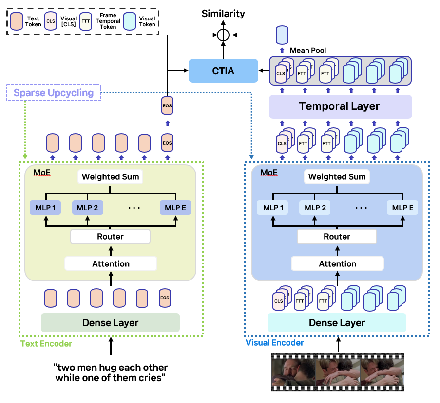

# TAME : Temporal-Aware-Mixture-of-Experts-for-Text-Video-Retrieval

---
<p align="center">
  
</p>

## Requirements

We recommend creating a dedicated conda environment:

**Recommended Environment**

- OS: Ubuntu 18.04.6 LTS
- CUDA: 11.7
- Python: 3.7.16
- PyTorch: 1.13.1+cu117
- Torchvision: 0.14.1+cu117
- GPU: 4 × NVIDIA RTX A6000

**Python Packages**
```bash
pip install ftfy regex tqdm
pip install opencv-python boto3 requests pandas
```
For additional dependencies, please refer to requirements.txt.


## Data Preparation

This project relies on three standard text–video datasets: MSR-VTT, MSVD, and DiDeMo.  
Please follow the instructions below to download the raw videos and obtain the official splits.

### MSR-VTT

- Raw videos: download from the CVF dataset page  
  - [https://cove.thecvf.com/datasets/839](https://cove.thecvf.com/datasets/839)
- Train/val/test split files:  
  - Provided in the *collaborative-experts* repository under  
    [misc/datasets/msrvtt](https://github.com/albanie/collaborative-experts/tree/master/misc/datasets/msrvtt)

### MSVD

- Raw videos: available at the MSVD video description project page  
  - [https://www.cs.utexas.edu/~ml/clamp/videoDescription/](https://www.cs.utexas.edu/~ml/clamp/videoDescription/)
- Train/val/test split files:  
  - Reuse the splits from *collaborative-experts* under  
    [misc/datasets/msvd](https://github.com/albanie/collaborative-experts/tree/master/misc/datasets/msvd)

### DiDeMo

- Raw videos: follow the download instructions from the *Localizing Moments in Video* repository  
  - [https://github.com/LisaAnne/LocalizingMoments](https://github.com/LisaAnne/LocalizingMoments)
- Splits and additional details:  
  - See the DiDeMo README in *collaborative-experts*:  
    [misc/datasets/didemo/README.md](https://github.com/albanie/collaborative-experts/blob/master/misc/datasets/didemo/README.md)

---

## Optional: Video Compression for Faster I/O

To speed up training and evaluation, you can pre-compress the raw videos:

```bash
python preprocess/compress_video.py \
  --input_root [RAW_VIDEO_DIR] \
  --output_root [COMPRESSED_VIDEO_DIR]
```

## How to Run

### 1. Prepare the data

Before running training and evaluation, make sure that all datasets (MSR-VTT, MSVD, and DiDeMo) have been properly downloaded and prepared.
---

### 2. Download the pretrained CLIP checkpoint

TAME is built on top of CLIP (ViT-B/32).  
Download the official CLIP weights and place them under the `modules/` directory:

```bash
wget -P ./modules \
  https://openaipublic.azureedge.net/clip/models/40d365715913c9da98579312b702a82c18be219cc2a73407c4526f58eba950af/ViT-B-32.pt
```

3. Training and Evaluation Scripts

## Pretrained Checkpoints

To quickly reproduce our results on MSR-VTT, we provide a pretrained TAME checkpoint.

### MSR-VTT (Text-to-Video Retrieval)

- Dataset: MSR-VTT (1K-A split)
- Backbone: CLIP ViT-B/32
- Checkpoint: [Download](https://drive.google.com/drive/folders/1lUDDSgMkNYFlijIfeoBGDqEVsJ4_OFO8?usp=sharing)

After downloading, place the checkpoint under the `ckpts/` directory, for example:

```text
ckpts/
  tame_msrvtt_vitb32.pth
```
You can then run evaluation on MSR-VTT without training:

```bash
sh scripts/MSRVTT_Eval.sh
```

Before running the script, make sure that the --init_model argument inside scripts/MSRVTT_Eval.sh is set to the path of your pretrained checkpoint, for example:

```bash
--init_model [PATH_TO_YOUR_CHECKPOINT]
# e.g.
# --init_model ckpts/tame_msrvtt_vitb32.pth
```

The main training and evaluation pipelines can be launched via the shell scripts provided in the scripts/ directory.

MSR-VTT

```bash
# Training
sh scripts/MSRVTT_Train.sh
# Evaluation
sh scripts/MSRVTT_Eval.sh
```

MSVD

```bash
# Training
sh scripts/MSVD_Train.sh
# Evaluation
sh scripts/MSVD_eval.sh
```

DiDeMo

```bash
# Training
sh scripts/DiDeMo_Train.sh
# Evaluation
sh scripts/DiDeMo_Eval.sh
```

# Acknowledgments
The implementation of TAME relies on resources from [CLIP](https://github.com/openai/CLIP "CLIP"), [CLIP4Clip](https://github.com/ArrowLuo/CLIP4Clip "CLIP4Clip"), [CLIP-MoE](https://github.com/OpenSparseLLMs/CLIP-MoE).


